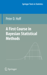

### A First Course in Bayesian Statistical Methods

  

<h4>Ordering information </h4>
<a href="http://www.springer.com/statistics/statistical+theory+and+methods/book/978-0-387-92299-7">Springer website</a>    
<a href="http://www.amazon.com/Bayesian-Statistical-Methods-Springer-Statistics/dp/0387922997">Amazon</a>

<h4>Reviews</h4> 
<a href="href=http://pubs.amstat.org/doi/abs/10.1198/jasa.2010.br1006">JASA</a>  
<a href="href=http://onlinelibrary.wiley.com/doi/10.1111/j.1467-985X.2010.00646_7.x/abstract">JRSS-A</a>     
<a hre="href=http://onlinelibrary.wiley.com/doi/10.1111/j.1368-423X.2009.00306.x/abstract">Econometrics Journal</a>   
<a href="http://onlinelibrary.wiley.com/doi/10.1111/j.1751-5823.2010.00109_17.x/abstract">International Statistical Review</a> 

